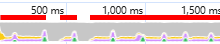
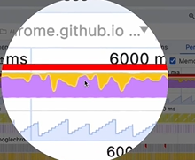
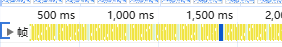
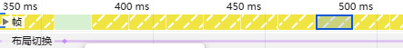
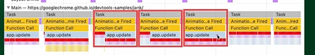
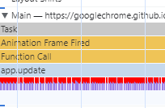
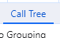
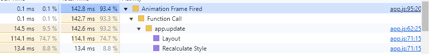

谷歌官方例子

https://googlechrome.github.io/devtools-samples/jank/

Performance选项卡

打开"性能"选项卡

录制一段时间的页面卡顿

红色线条(其实是一节一节的或者说一块一块的)表示性能有问题

黄色的表示脚本执行

紫色的表示渲染

绿色的表示绘制

再往下是内存占用

锯齿状的

渲染帧

正常情况下, 按理说应该全部是绿色的

有黄色甚至红色的, 说明帧被延后了或者是跳过了

可以放大这段时间线, 双击, 选取范围

绿色表示正常渲染

黄色表示部分渲染, 渲染主线程没有参与, 合成线程参与渲染了

红色表示没有渲染

60FPS是16.6ms一帧, 1000/60=16.6ms

task任务, 事件循环那的知识

Animation Frame Fired是requestAnimationFrame(()=>{})触发的

Function Call 函数调用

再往下看

有详细信息

可以看到时间消耗, Layout占用时间多

是个CPU密集型的任务

右边点击可以看到源代码, 定位到哪个函数的哪一行

.offsetTop获取几何信息

立即 reflow

本质是重新计算 layout 树

.style.top

是dom树的